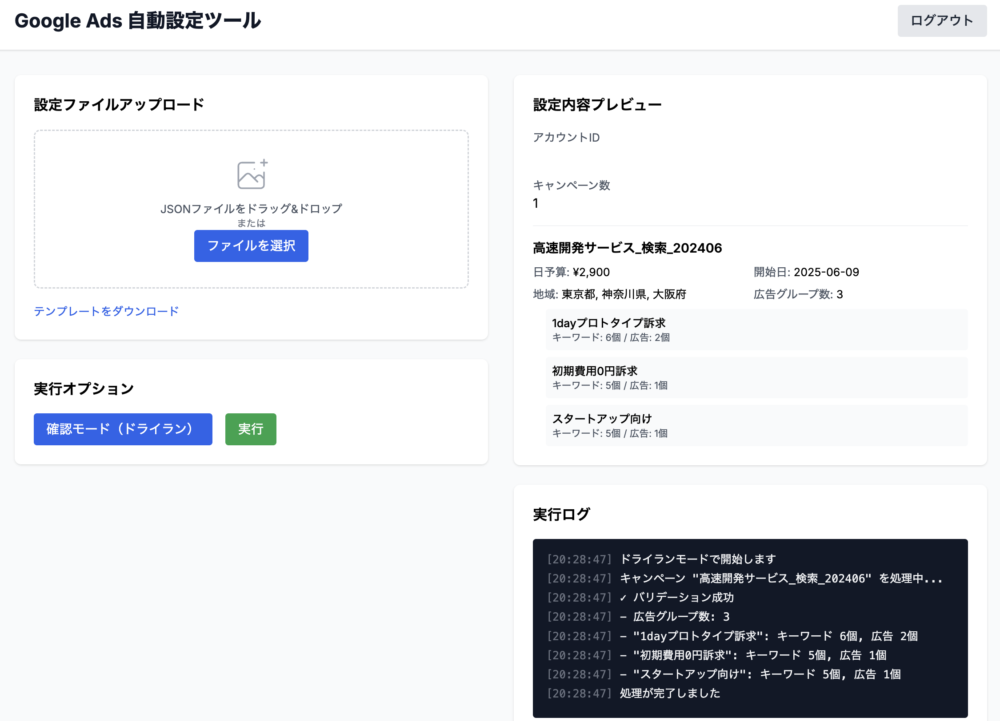

# Google Ads 自動設定ツール

JSONファイルをアップロードするだけでGoogle Ads広告キャンペーンを自動作成するWebアプリケーション



## 機能

- 📤 JSONファイルのドラッグ&ドロップアップロード
- 🔐 Google OAuth認証
- 🚀 キャンペーン、広告グループ、キーワード、広告の一括作成
- 👀 ドライランモードで事前確認
- 📊 リアルタイム実行ログ

## クイックスタート

1. 依存関係のインストール
```bash
npm install
```

2. 環境変数の設定
`.env.local`ファイルを作成し、必要な情報を設定（詳細は`docs/setup-guide.md`参照）

3. Google Cloud Consoleでテストユーザーを追加
- OAuth同意画面でテストユーザーとしてメールアドレスを登録
- これを行わないと認証エラー(403)が発生します

4. テストアカウントの作成（重要）
- 初回の開発者トークンはテストアカウント専用
- MCCアカウントからテストアカウントを作成
- 本番利用には別途「Basic Access」申請が必要

5. 開発サーバーの起動
```bash
npm run dev
```

4. http://localhost:3000 にアクセス

## JSON設定フォーマット

```json
{
  "accountId": "123-456-7890",
  "campaigns": [{
    "name": "キャンペーン名",
    "dailyBudget": 5000,
    "startDate": "2024-06-09",
    "locations": ["東京都"],
    "adGroups": [{
      "name": "広告グループ名",
      "keywords": [
        {"text": "キーワード", "matchType": "PHRASE", "bidAmount": 100}
      ],
      "ads": [{
        "headlines": ["見出し1", "見出し2", "見出し3"],
        "descriptions": ["説明文1", "説明文2"],
        "finalUrl": "https://example.com"
      }]
    }]
  }]
}
```

## セットアップ詳細

詳しいセットアップ手順は [docs/setup-guide.md](docs/setup-guide.md) を参照してください。